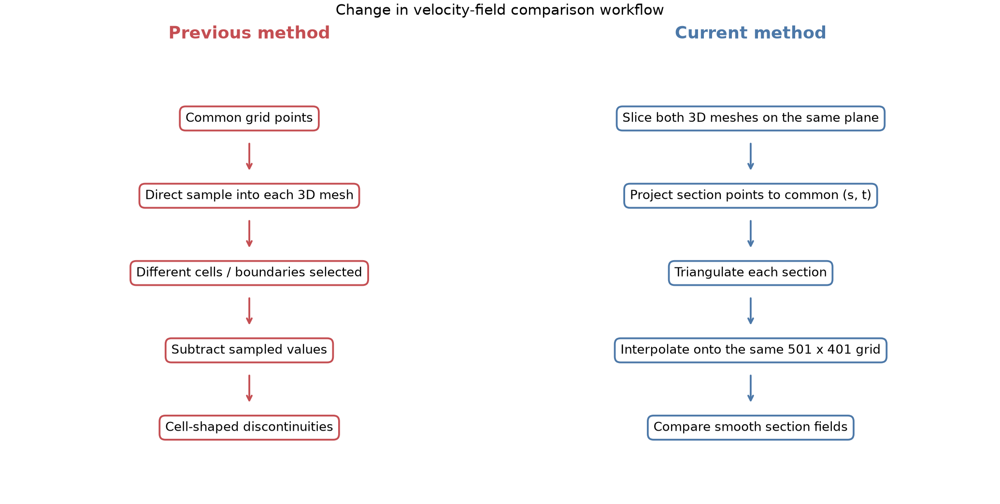
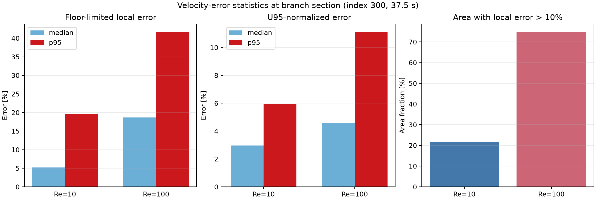
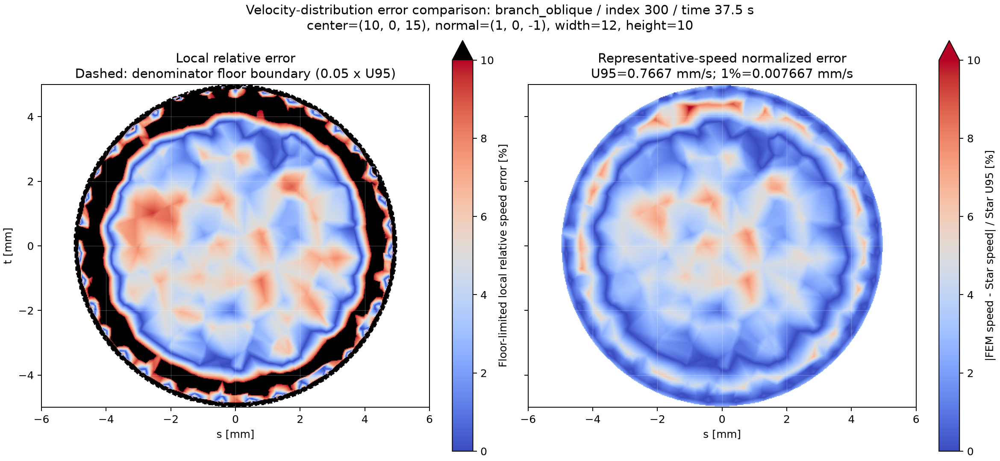
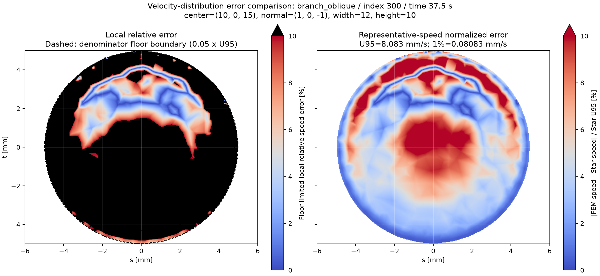
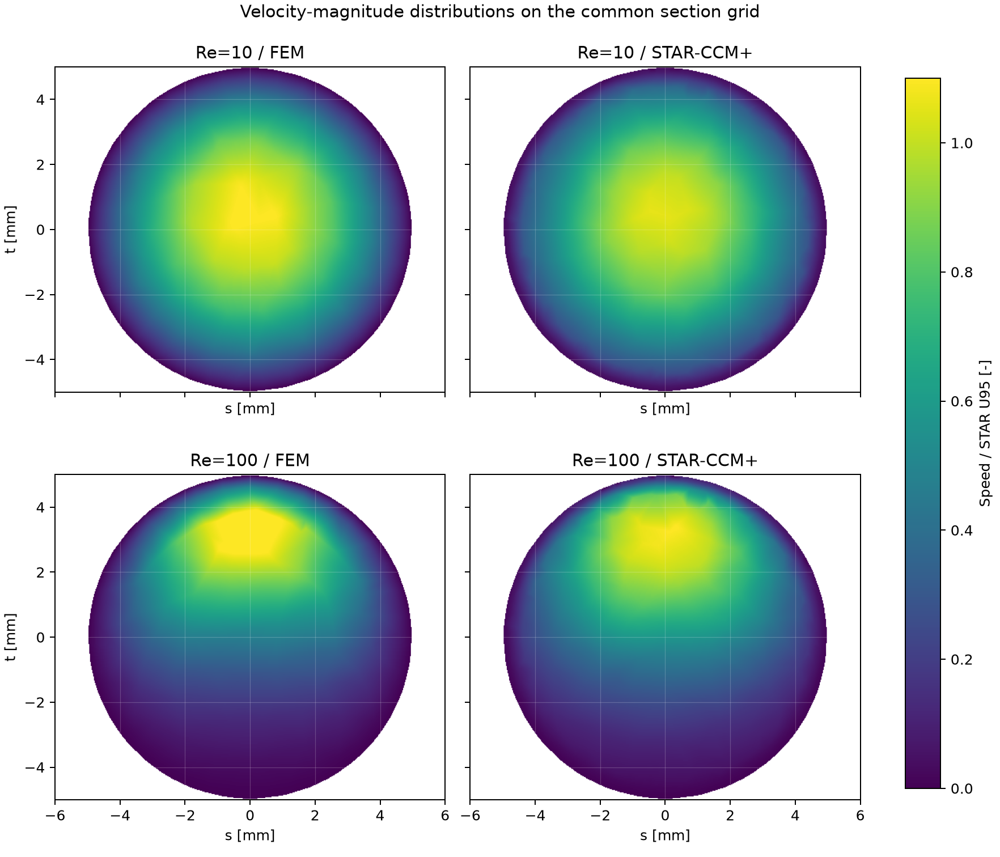
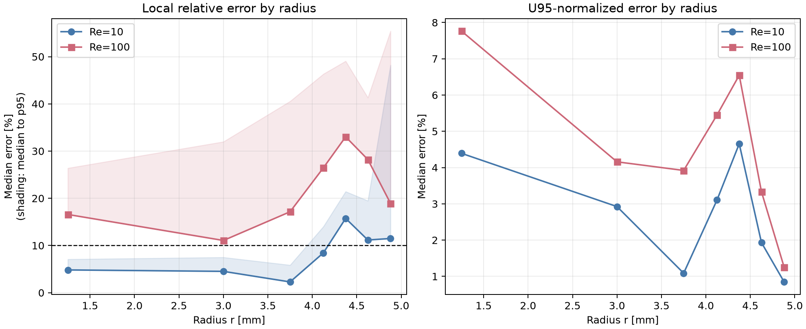
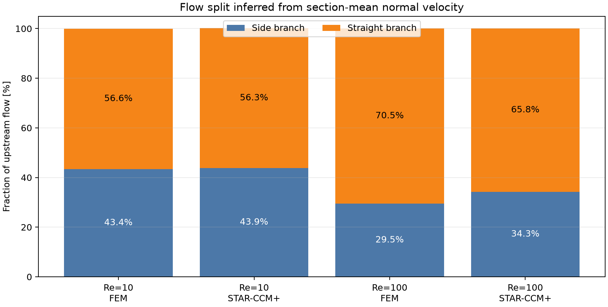

# 流速誤差比較の進捗報告

作成日: 2026-07-21

## 1. 目的

FEM solverとSTAR-CCM+の断面流速分布を比較し、当初の誤差図に現れていた人工的な不連続を解消する。また、Re=10とRe=100で誤差分布が変化した理由を、力学・境界条件・数値計算の観点から整理する。

対象断面は`center=(10, 0, 15) mm`、`normal=(1, 0, -1)`、時刻index 300（37.5 s）である。

## 2. 当初の問題と原因

当初は共通格子点から各3Dメッシュへ直接`sample()`し、FEMとSTAR-CCM+の速度を比較していた。STAR速度はセルデータであり、サンプリング点がセル境界を越えると参照セルが切り替わる。さらに、両解析でセル境界・点配置・セル形状が一致しないため、流速分布自体は滑らかでも、差を取るとセル状・ブロック状の不連続が現れた。

## 3. 実施した解決策

1. 3Dメッシュへの直接サンプリングをやめ、両解析を同じ平面で`mesh.slice()`した。
2. STARのセル速度は`cell_data_to_point_data()`で点速度へ変換してから断面化した。
3. 断面上の点を共通の2D座標`(s,t)`へ射影した。
4. 共有エッジや複数ブロックに由来する同一座標の重複点を平均した。
5. 各断面点群を三角形分割し、両解析を同じ`501 x 401`格子へ区分線形補間した。
6. 同じ格子座標における速度大きさ`|u|`同士を比較した。

この変更により、異なる3Dセル構造を直接比較するのではなく、同じ断面座標に補間された滑らかな速度分布同士を比較でき、人工的な不連続が大幅に減少した。



このフロー図は、人工的な不連続が生じた旧方式と、現在の比較方式の処理順序を対比したものである。旧方式では異なる3Dセルを直接参照していたのに対し、現在は両解析をいったん断面化し、同じ2D格子へ補間してから比較している。不連続解消が単なる画像平滑化ではなく、比較位置を統一した結果であることを示す意図で作成した。

## 4. 現在の誤差指標

主図は下限付き局所相対誤差である。

```text
E_local = ||u_FEM| - |u_STAR|| / max(|u_STAR|, 0.05 U95) x 100 [%]
```

`U95`は共通断面格子上のSTAR速度の95パーセンタイルである。壁面近傍で`|u_STAR| -> 0`となる際の相対誤差発散を防ぐため、分母に`0.05 U95`の下限を設けた。

補助図は代表速度正規化誤差である。

```text
E_global = ||u_FEM| - |u_STAR|| / U95 x 100 [%]
```

左図は`0-10%`を赤青の連続色、10%超を黒で表示し、主流部の差を読みやすくした。右図は断面全体の速度スケールに対する差を連続色で表示する。

## 5. Re=10 / Re=100の結果

| case | Star U95 [mm/s] | local median [%] | local p95 [%] | area above 10% [%] | U95-normalized median [%] | U95-normalized p95 [%] |
| --- | --- | --- | --- | --- | --- | --- |
| Re=10 | 0.767 | 5.170 | 19.600 | 21.699 | 2.957 | 5.955 |
| Re=100 | 8.083 | 18.635 | 41.731 | 74.902 | 4.561 | 11.130 |

この表は、対象断面全体について局所相対誤差と代表速度正規化誤差を数値で要約したものである。中央値は断面内の典型的な誤差、95パーセンタイルは大きな誤差領域を含めた上側の代表値、10%超面積率は局所誤差が表示上限を超える範囲の広さを表す。最大値だけに左右されず、誤差の大きさと空間的な広がりを同時に比較するために作成した。



`error_metrics_comparison`の左パネルは下限付き局所相対誤差の中央値と95パーセンタイル、中央パネルは`U95`正規化誤差の中央値と95パーセンタイル、右パネルは局所誤差10%超の面積割合を示す。左と中央を比較することで、局所速度が小さいため割合だけが大きいのか、断面全体の速度スケールに対しても差が大きいのかを区別する意図がある。右パネルは、誤差が局所的な点に限られるのか、断面の広い範囲へ及ぶのかを示す。

Re=100では、局所誤差10%超の面積がRe=10の約21.7%から約74.9%へ拡大した。代表速度正規化誤差の95パーセンタイルも約6.0%から約11.1%へ増えているため、低速域の分母だけではなく、速度分布そのものの差が増加している。

### Re=10の誤差分布



左図は下限付き局所相対誤差を0-10%の連続色で表示し、10%超を黒で示す。主流部の数%程度の違いを読み取りやすくしながら、境界層などの大誤差領域を識別することが目的である。右図は同じ絶対速度差を`U95`で正規化し、流れ全体の速度スケールに対する実質的な差を示す。破線は局所STAR速度ではなく`0.05 U95`が分母として使われ始める境界である。

### Re=100の誤差分布



Re=10と同じ座標、誤差定義、表示上限、配色で作成しているため、黒色領域の増加をRe間で直接比較できる。右図も併記することで、Re=100の黒色領域拡大が低速域の分母だけによるものか、絶対速度差の増加も伴うのかを判定する意図がある。

## 6. 速度分布と半径方向の誤差



`normalized_velocity_fields`は、Re=10/100についてFEMとSTAR-CCM+の速度大きさをそれぞれのSTAR `U95`で割り、共通の無次元カラースケールで並べた図である。誤差値だけでは分からない速度分布の形、ピーク位置、偏り、境界層厚さが定性的に一致しているかを確認するために作成した。Re間の速度倍率を除いて分布形状を比較できる。



`radial_error_comparison`は断面中心からの半径`r=sqrt(s^2+t^2)`で格子点を区分し、誤差を半径方向に集計した図である。左パネルの線とマーカーは各半径区間の局所相対誤差中央値、薄い領域は中央値から95パーセンタイルまでを表す。この薄い領域は標準偏差や信頼区間ではなく、同じ半径に存在する周方向の不均一性と局所的な高誤差の広がりを示す。右パネルは`U95`正規化誤差の中央値であり、中心部と壁面近傍のどちらで実質的な速度差が増えたかを切り分ける目的で作成した。

Re=100ではプリズムレイヤーだけでなく、断面中心部でも局所誤差が増加した。したがって、誤差範囲の拡大を壁面近傍の相対誤差増幅だけで説明することはできない。

## 7. 分岐流量配分

| case | source | side branch [%] | straight branch [%] | closure [%] |
| --- | --- | --- | --- | --- |
| Re=10 | FEM | 43.422 | 56.562 | 99.984 |
| Re=10 | STAR-CCM+ | 43.870 | 56.272 | 100.142 |
| Re=100 | FEM | 29.517 | 70.534 | 100.051 |
| Re=100 | STAR-CCM+ | 34.260 | 65.817 | 100.077 |

この表は、分岐前断面の平均法線速度を基準に、側枝と直進側へ流れた割合をFEMとSTAR-CCM+で比較したものである。`closure`は側枝割合と直進側割合の合計で、約100%であれば3断面間の流量収支が概ね整合していることを示す。値は共通格子上の平均法線速度から推定した近似であり、最終的には各ソルバーの面積積分流量で確認する必要がある。



`flow_split_comparison`は上表を積み上げ棒グラフにしたもので、青が側枝、橙が直進側の割合を表す。Re=100で誤差領域が広がった原因を、単なる補間誤差や境界層誤差ではなく、分岐流量配分という力学的な違いとして説明できるか確認する意図で作成した。

Re=10ではFEMとSTARの側枝流量割合が約43.4%と43.9%でほぼ一致した。Re=100ではFEMが約29.5%、STARが約34.3%となり、FEMはSTARより側枝へ流れる割合が約4.7ポイント少ない。この流量配分差が側枝断面全体の速度レベルを変え、広い誤差領域として現れた。

## 8. 力学的な解釈

- 入口速度を10倍にするとReは10から100になり、粘性に対する慣性の割合が10倍になる。
- 動圧および分岐局所損失のスケール`rho U^2`は約100倍になる。
- 高Reでは流体が直進方向の運動量を保ちやすく、側枝へ曲がるためにより大きな圧力勾配が必要になる。
- 粘性による速度分布の平滑化が弱くなり、分岐角部の剥離位置や圧力損失の小さな差が下流まで残りやすい。
- 両ソルバーともRe=100では直進側流量が増えるが、その増え方が異なるため、側枝断面全体に差が広がった。

## 9. シミュレーション上の解釈

- Re=10/100でメッシュのセル数、領域、セルサイズ統計は同じである。ただし、高Reでは境界層が薄くなるため、同じメッシュの実効解像度は低下する。
- 時間刻みは両ケースとも`dt=0.125 s`で、速度が10倍になるため移流CFLも概ね10倍になる。代表セル幅約0.5 mmでは概算CFLが約0.25から約2.5へ増える。
- 暗黙法では安定でも、移流精度、数値拡散、安定化手法の違いが結果へ現れやすい。
- STARのセルデータから点データへの平均変換は、急勾配を持つプリズム層で速度プロファイルをぼかす可能性がある。
- index 280、290、300で流量比と誤差統計はほぼ一定であり、今回の差は最終時刻の未収束や一時的な位相差ではない。

## 10. 境界条件に関する考察

分岐前断面ではFEM/STARの平均流量比がRe=10、Re=100とも約1.026であり、入口流量差だけでは側枝誤差の拡大を説明できない。一方、分岐後の流量配分はRe=100で明確に異なる。

したがって、優先的に確認すべきなのは、両ソルバーにおける側枝・直進出口の圧力条件、自然流出条件、圧力基準点、逆流処理が本当に等価かどうかである。高Reでは分岐損失が慣性支配になるため、出口条件の小さな差が流量配分に強く反映される。

## 11. 現時点の結論

1. 当初の不連続は、異なる3Dセル構造へ直接`sample()`した比較処理に由来する人工的なものだった。
2. 両解析を断面化し、共通2D格子へ線形補間して比較することで不連続を解消した。
3. Re=100の誤差増加は、境界層の局所相対誤差だけではなく、分岐流量配分と主流部速度分布の差を含む。
4. 力学的には慣性増加による直進性と分岐損失感度、数値的には同一メッシュ・同一dtでの移流支配性増加が有力である。
5. 境界条件の影響は疑われるが、入口条件そのものより出口圧力・流出条件と分岐流量配分を重点的に確認すべきである。

## 12. 次に行うとよい確認

1. FEMとSTARで入口、側枝、直進側の面積積分流量を直接出力する。
2. 側枝流量比、直進側流量比、分岐前後の圧力損失を比較する。
3. 出口pressure/traction条件、圧力基準、逆流条件を完全に揃える。
4. Re=100で`dt=0.0625 s`および`0.03125 s`の時間刻み依存性を確認する。
5. 分岐部とプリズム層のメッシュ細分化依存性を確認する。
6. 可能ならSTARから点データ速度を直接出力し、セル平均変換の影響を切り分ける。

## 13. 主要ファイル

- 比較処理: `scripts/relative_error_colormap_solver_star_ccm.py`
- 現在の設定: `config/relative_error_colormap_solver_star_ccm.json`
- 集計表: `tables/metrics_summary.csv`, `tables/flow_split_summary.csv`, `tables/radial_error_summary.csv`
- ChatGPT共有用短縮版: `chatgpt_context.md`
